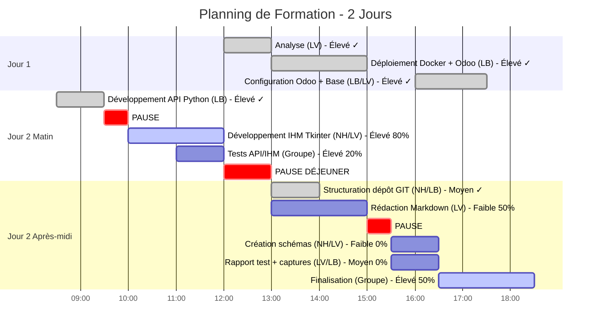

# Projet-Odoo
ERP Odoo

```mermaid
gantt
    title Planning de Formation - 2 Jours
    dateFormat HH:mm
    axisFormat %H:%M

    section Jour 1
    Analyse (LV) - Élevé ✓           :done, j1t1, 12:00, 1h
    Déploiement Docker + Odoo (LB) - Élevé ✓ :done, j1t2, 13:00, 2h
    Configuration Odoo + Base (LB/LV) - Élevé ✓ :done, j1t3, 16:00, 1.5h
    
    section Jour 2 Matin
    Développement API Python (LB) - Élevé ✓ :done, j2t1, 08:30, 1h
    PAUSE                            :crit, j2p1, 09:30, 0.5h
    Développement IHM Tkinter (NH/LV) - Élevé 80% :active, j2t2, 10:00, 2h
    Tests API/IHM (Groupe) - Élevé 20% :j2t3, 11:00, 1h
    PAUSE DÉJEUNER                   :crit, j2p2, 12:00, 1h
    
    section Jour 2 Après-midi
    Structuration dépôt GIT (NH/LB) - Moyen ✓ :done, j2t4, 13:00, 1h
    Rédaction Markdown (LV) - Faible 50% :j2t5, 13:00, 2h
    PAUSE                            :crit, j2p3, 15:00, 0.5h
    Création schémas (NH/LV) - Faible 0% :j2t6, 15:30, 1h
    Rapport test + captures (LV/LB) - Moyen 0% :j2t7, 15:30, 1h
    Finalisation (Groupe) - Élevé 50% :active, j2t8, 16:30, 2h
```
