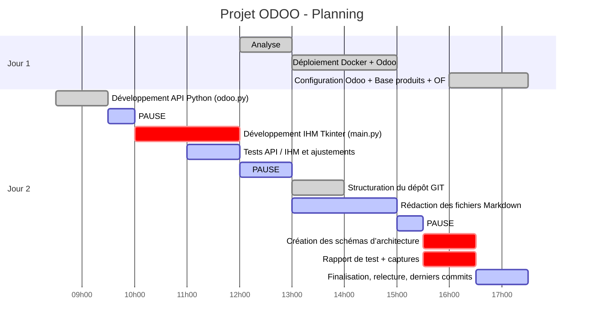

# Projet-Odoo
ERP Odoo

```mermaid
gantt
    title Projet ODOO - Planning
    dateFormat  HH:mm
    axisFormat  %Hh%M

    section Jour 1
    Analyse                          :done,    12:00, 13:00
    Déploiement Docker + Odoo        :done,    13:00, 15:00
    Configuration Odoo + Base produits + OF :done, 16:00, 17:30

    section Jour 2
    Développement API Python (odoo.py)       :done,    08:30, 09:30
    PAUSE                                   :active,  09:30, 10:00
    Développement IHM Tkinter (main.py)     :crit,    10:00, 12:00
    Tests API / IHM et ajustements          :active,  11:00, 12:00
    PAUSE                                   :active,  12:00, 13:00
    Structuration du dépôt GIT              :done,    13:00, 14:00
    Rédaction des fichiers Markdown         :active,  13:00, 15:00
    PAUSE                                   :active,  15:00, 15:30
    Création des schémas d’architecture     :crit,    15:30, 16:30
    Rapport de test + captures              :crit,    15:30, 16:30
    Finalisation, relecture, derniers commits :active, 16:30, 17:30

```
